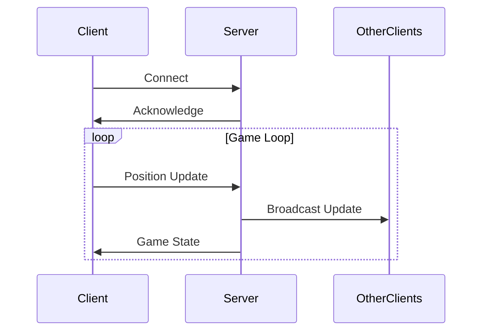

# 🎮 Yasser's Adventure - Game Documentation

## 📋 Table of Contents
- [Game Overview](#game-overview)
- [Setup & Installation](#setup--installation)
- [Network Architecture](#network-architecture)
- [Game Components](#game-components)
- [Game Logic](#game-logic)
- [File Structure](#file-structure)

## 🎯 Game Overview
Yasser's Adventure is a fun arcade-style game where players control a character trying to dodge falling enemies. The longer you survive, the higher your score! The game features multiplayer capabilities, high score tracking, and progressive difficulty.

## 🔧 Setup & Installation
1. Ensure you have Python and Pygame installed
2. Clone the repository
3. Run `main.py` to start the game
4. Choose server ('s') or client ('c') mode
5. Enter your nickname and start playing! 

## 🌐 Network Architecture

### Server Side (`game_server.py`)
```python
# Key components:
- TCP Socket Server (port configurable)
- Threaded client handling
- Player state management
```

The server:
- 👥 Handles multiple client connections using threading
- 🔄 Maintains player states in a thread-safe dictionary
- 📡 Broadcasts player updates to connected clients

### Client Side (`game_client.py`)
```python
# Key components:
- TCP Socket Client
- Pygame rendering
- Game state management
```

The client:
- 🎮 Handles player input
- 🖼️ Renders game state
- 📤 Sends player updates to server
- 📥 Receives game state updates

## 🎲 Game Components

### Player
- 🟦 Represented as a rectangle
- ⌨️ Controlled using A/D or LEFT/RIGHT arrow keys
- 🏃‍♂️ Moves horizontally at the bottom of the screen

### Enemies (`enemy.py`)
- 🟥 Fall from the top of the screen
- ⚡ Random speed variations
- 📈 Spawn rate increases over time

### Score System (`utils.py`)
- 💾 Persistent high scores using JSON
- 📊 Top 10 scores maintained
- 👤 Player nicknames stored with scores

## 🎨 Game Logic & Drawing

### Main Game Loop
1. Handle player input
2. Update enemy positions
3. Check for collisions
4. Update score
5. Draw game state

### Drawing Pipeline
```python
# Drawing order:
1. Clear screen (background)
2. Draw player rectangle
3. Draw enemy rectangles
4. Draw score
5. (If game over) Draw game over screen
```

### Game Over Screen
- 📝 Displays final score
- 🏆 Shows top 5 high scores
- 🔄 Spacebar to restart
- 👥 Player nicknames displayed

## 📁 File Structure

### `main.py`
- 🎬 Entry point
- 🔀 Mode selection (server/client)
- 🎮 Game initialization

### `config.py` (not shown but referenced)
Contains game constants:
- 🖼️ WINDOW_SIZE
- 🎯 PLAYER_SIZE
- 👾 ENEMY_SIZE
- ⚡ ENEMY_SPEED
- 🕒 INITIAL_SPAWN_RATE

### `utils.py`
Score management:
- 💾 save_score()
- 📊 load_scores()

## 🎮 Gameplay Tips
1. Start moving early - don't let enemies get too close!
2. Watch for speed variations in enemies
3. Keep track of multiple enemies at once
4. Try to beat your high score!

## 🔄 Network Flow


## 🚀 Future Improvements
- Add power-ups
- Implement different enemy types
- Add sound effects
- Create difficulty levels
- Add multiplayer interaction

Happy gaming! 🎮✨
