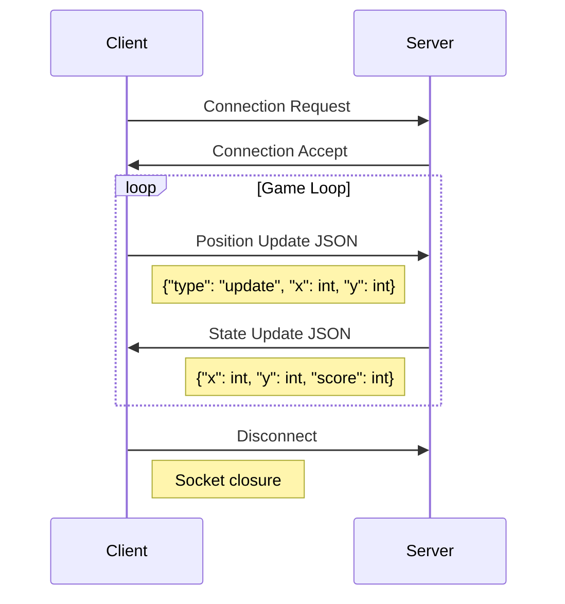
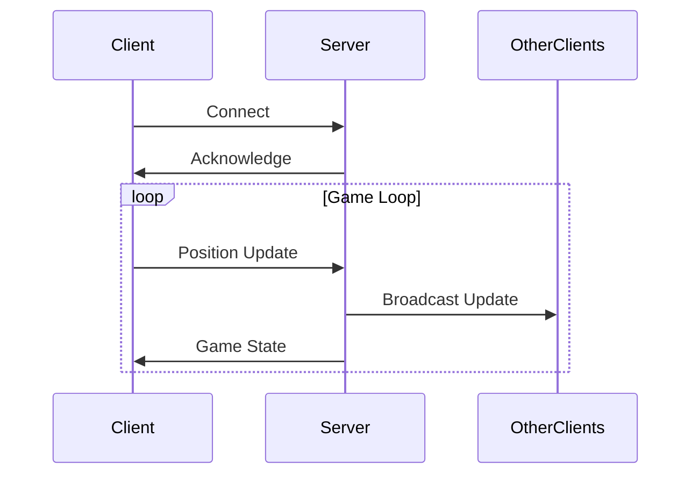

# 🎮 Yasser's Adventure - Technical Documentation

## 📋 Table of Contents
- [Network Architecture](#network-architecture)
- [Pygame Implementation](#pygame-implementation)
- [Game Loop Analysis](#game-loop-analysis)
- [State Management](#state-management)
- [Technical Components](#technical-components)

## 🌐 Network Architecture

### TCP Socket Implementation
```python
# Server-side socket initialization
self.server_socket = socket.socket(socket.AF_INET, socket.SOCK_STREAM)
self.server_socket.bind((host, port))
self.server_socket.listen(5)  # Connection backlog of 5
```

#### Server Threading Model
```python
def handle_client(self, client_socket, address):
    player_id = str(address)
    with self.lock:  # Thread-safe player management
        self.players[player_id] = {
            'x': WINDOW_SIZE[0] // 2,
            'y': WINDOW_SIZE[1] - PLAYER_SIZE - 10,
            'score': 0
        }
```

Key components:
- 🔒 Thread synchronization using `threading.Lock()`
- 🔄 Concurrent client handling
- 🗃️ Thread-safe player state dictionary

### Network Protocol


### Data Serialization
```python
# Server-side message handling
data = client_socket.recv(1024).decode()  # Buffer size: 1024 bytes
message = json.loads(data)  # JSON deserialization
```

## 🎨 Pygame Implementation

### Display Management
```python
# Display initialization
self.screen = pygame.display.set_mode(WINDOW_SIZE)
pygame.display.set_caption("Yasser's Adventure")
self.clock = pygame.time.Clock()  # Frame rate control
```

### Draw Pipeline Architecture
```python
def draw_game(self):
    # Screen clearing - O(window_size) operation
    self.screen.fill(BACKGROUND_COLOR)
    
    # Player rendering - O(1) operation
    pygame.draw.rect(self.screen, PLAYER_COLOR, 
                    (self.x, self.y, PLAYER_SIZE, PLAYER_SIZE))
    
    # Enemy rendering - O(n) operation where n = number of enemies
    for enemy in self.enemies:
        pygame.draw.rect(self.screen, ENEMY_COLOR, 
                        (enemy.x, enemy.y, ENEMY_SIZE, ENEMY_SIZE))
    
    # Score rendering - O(1) operation
    score_text = self.font.render(f'Score: {self.score}', True, (0, 0, 0))
    self.screen.blit(score_text, (10, 10))
```

## 🎯 Game Loop Analysis

### Main Loop Structure
```python
def run(self):
    while running:
        # 1. Event Handling - O(e) where e = number of events
        self.handle_events()
        
        # 2. Game State Update - O(n) where n = number of entities
        self.update_game_state()
        
        # 3. Rendering - O(n) where n = number of entities
        self.render_frame()
        
        # 4. Frame Rate Control
        self.clock.tick(60)  # 60 FPS target
```

### Critical Timing Functions
```python
def spawn_enemies(self):
    current_time = pygame.time.get_ticks()  # Millisecond precision
    if current_time - self.last_spawn_time > self.spawn_rate:
        self.enemies.append(Enemy())
        self.last_spawn_time = current_time
        self.spawn_rate = max(400, self.spawn_rate - 1)  # Progressive difficulty
```

## 💾 State Management

### Player State Structure
```python
class GameClient:
    def __init__(self):
        self.x = WINDOW_SIZE[0] // 2  # Horizontal position
        self.y = WINDOW_SIZE[1] - PLAYER_SIZE - 10  # Vertical position
        self.score = 0  # Player score
        self.game_over = False  # Game state flag
```

### Enemy State Management
```python
class Enemy:
    def __init__(self):
        # Randomized initialization
        self.x = random.randint(0, WINDOW_SIZE[0] - ENEMY_SIZE)
        self.y = -ENEMY_SIZE  # Start above screen
        self.speed = random.uniform(ENEMY_SPEED - 1, ENEMY_SPEED + 2)
```

## 🔧 Technical Components

### Collision Detection System
```python
def check_collisions(self):
    player_rect = pygame.Rect(self.x, self.y, PLAYER_SIZE, PLAYER_SIZE)
    
    # O(n) collision check where n = number of enemies
    for enemy in self.enemies:
        enemy_rect = pygame.Rect(enemy.x, enemy.y, ENEMY_SIZE, ENEMY_SIZE)
        if player_rect.colliderect(enemy_rect):
            return True
    return False
```

### Score Persistence System
```python
def save_score(score, nickname):
    scores = load_scores()  # Load existing scores
    scores.append({"score": score, "nickname": nickname})
    scores.sort(key=lambda x: x["score"], reverse=True)
    scores = scores[:10]  # Maintain top 10 scores only
    
    with open(SCORES_FILE, 'w') as f:
        json.dump(scores, f)  # Atomic write operation
```

### Network Message Format
```javascript
// Client -> Server
{
    "type": "update",
    "x": number,  // Player X position
    "y": number   // Player Y position
}

// Server -> Client
{
    "players": {
        "player_id": {
            "x": number,
            "y": number,
            "score": number
        }
    }
}
```

### Performance Considerations
1. 🚀 Frame Rate Management
   ```python
   self.clock.tick(60)  # Caps at 60 FPS
   ```

2. 🔄 State Update Optimization
   ```python
   # O(n) enemy cleanup with list comprehension
   self.enemies = [e for e in self.enemies if e.active]
   ```

3. 📊 Memory Management
   ```python
   # Efficient score limiting
   scores = scores[:10]  # Constant memory usage
   ```

## 🔍 Debug Tools
```python
def debug_info(self):
    debug_text = [
        f"FPS: {int(self.clock.get_fps())}",
        f"Enemies: {len(self.enemies)}",
        f"Player Pos: ({self.x}, {self.y})",
        f"Spawn Rate: {self.spawn_rate}ms"
    ]
    return debug_text
```

## 🎮 Technical Constants
```python
WINDOW_SIZE = (800, 600)
PLAYER_SIZE = 32
ENEMY_SIZE = 32
ENEMY_SPEED = 5
PLAYER_SPEED = 5
INITIAL_SPAWN_RATE = 1000  # milliseconds
```


## 🔄 Network Flow


### Drawing Pipeline
```python
# Drawing order:
1. Clear screen (background)
2. Draw player rectangle
3. Draw enemy rectangles
4. Draw score
5. (If game over) Draw game over screen
```
